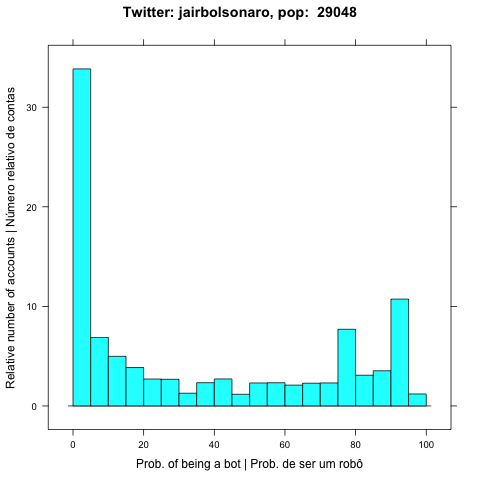

# Português
\n
## botCollector
\n
Esse programa analisa as contas que seguem uma conta alvo.
Cada conta que segue a conta alvo é analizada usando a API do projeto botometer
\n
## Resultados
\n
Gráfico mais recente:
\n

\n
[Versão em PDF](plots/plot.pdf)
\n
## Referências
Botometer: https://botometer.iuni.iu.edu/#!/
\n
Twitter API: https://developer.twitter.com/en/docs.html
\n
## Estatísticas:
\n
Porcentagem de contas com probabilidade acima de  + "75 + % de serem bots + 24.8693435309114
\n
Obs: essa porcentagem foi feita com base em uma população de  + 15690 +  ( a mesma usada no gráfico )
\n
Porcentagem de contas sem timeline:  + 34.7840667734844 + %
\n
Obs: essa porcentagem foi feita com base na população total verificada:  + 26837" +  ( Botometer não consegue estudar contas sem timeline )
\n
# English
\n
## botCollector
\n
This program aims at veryfying the accounts following a target account.
Each account that follows the target is given a score using the botometer API.
\n
## Results
\n
Most recent plot:
\n

\n
[PDF version](plots/plot.pdf)
\n
## References
\n
Botometer: https://botometer.iuni.iu.edu/#!/
\n
Twitter API: https://developer.twitter.com/en/docs.html
